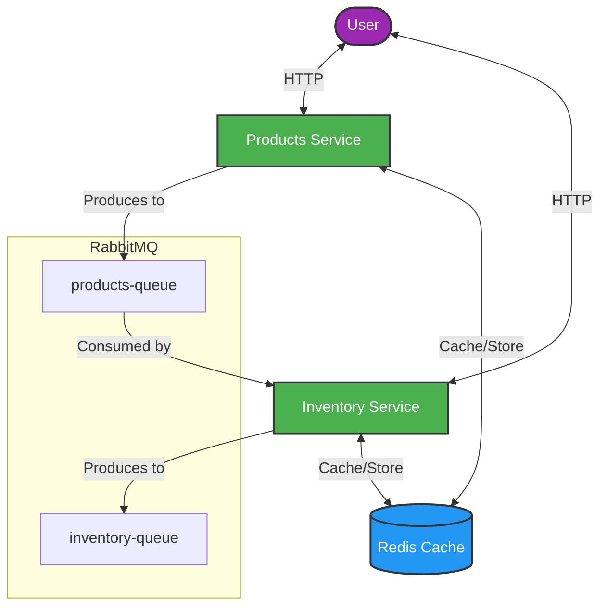
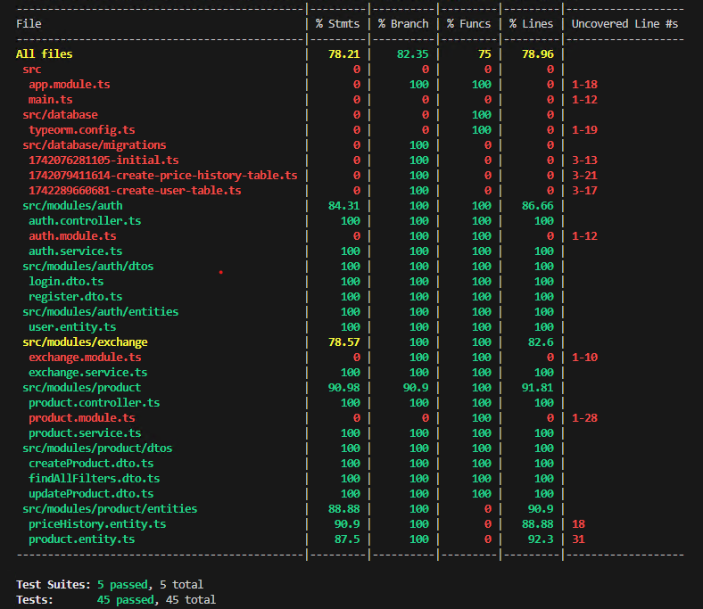
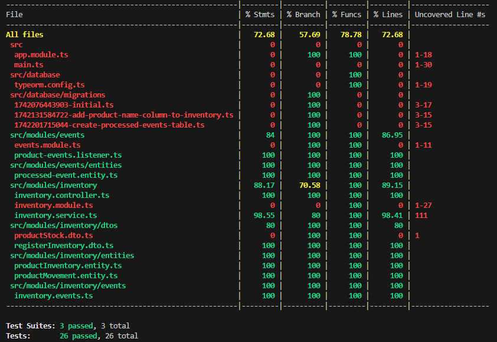

# Inventory System

## Overview

This project implements a comprehensive inventory management system composed of two microservices that work together to manage products and their inventory levels. The system is designed to be efficient, secure, and scalable, addressing the needs of businesses requiring robust inventory control.

## Table of Contents

- [Architecture](#architecture)
- [Features](#features)
- [Technology Stack](#technology-stack)
- [Project General Structure](#project-structure)
- [Setup Instructions](#setup-instructions)
- [API Documentation](#api-documentation)
- [Authentication and Authorization](#authentication-and-authorization)
- [Event-Driven Communication](#event-driven-communication)
- [Caching Strategy](#caching-strategy)
- [Currency Conversion](#currency-conversion)
- [Testing](#testing)
- [Design Considerations](#design-considerations)

## Architecture

The system follows a microservices architecture pattern with event-driven communication between services:

1. **Products Service**: Handles all CRUD operations related to product information
2. **Inventory Service**: Manages stock levels and inventory movements
3. **Shared Package**: Contains common code and utilities used by both services

The microservices communicate asynchronously through RabbitMQ, maintaining data consistency while remaining decoupled.




## Features

### Product Service

- Complete CRUD operations for products
- Product categorization
- Price history tracking
- Currency conversion for prices
- JWT-based authentication and role-based authorization

### Inventory Service

- Stock level management (increase/decrease)
- Inventory movement history
- Stock availability queries
- Event processing from Product Service

### System-wide Features

- Event-driven communication between services
- Redis caching for frequently accessed data
- Role-based access control
- Idempotent event processing
- Dockerized deployment

## Technology Stack

- **Framework**: NestJS
- **Language**: TypeScript
- **Database**: PostgreSQL
- **Caching**: Redis
- **Message Queue**: RabbitMQ
- **Authentication**: JWT
- **Project Management**: TurboRepo
- **Containerization**: Docker
- **Currency Conversion**: ExchangeRate API

## Project General Structure

```
inventory-system/
├── apps/
│   ├── products-service/
│   │   ├── src/
│   │   │   ├── modules/
│   │   │   ├── app.module.ts
│   │   │   └── main.ts
│   │   ├── test/
│   │   └── .env
│   └── inventory-service/
│       ├── src/
│       │   ├── modules/
│       │   ├── app.module.ts
│       │   └── main.ts
│       ├── test/
│       └── .env
├── packages/
│   └── shared/
│       ├── src/
│       │   ├── modules/
│       │   ├── config/
│       │   └── models/
│       └── package.json
├── docker-compose.yml
└── package.json
```

## Setup Instructions

### Installation

1. Clone the repository:
```bash
git clone https://github.com/username/inventory-system.git
cd inventory-system
```

2. Set up environment variables:
   - Copy the example .env files in each service directory
   - Rename the `.env.example` files located in the root of each microservice with `.env` to use the application with the default configuration.

3. Start the system using Docker Compose:
```bash
docker-compose up -d
```

This will start the following containers:
- PostgreSQL databases (for both services)
- Redis cache server
- RabbitMQ message broker
- Products service
- Inventory service


## API Documentation


## Product Service

The Product Service provides endpoints for managing products, including creation, retrieval, update, and deletion operations.

### Create Product

Creates a new product in the system.

```
POST /api/product
```

**Authorization:**
- Minimun Role: ADMIN

**Request Body:**
```json
{
  "name": "Product Name",
  "price": 99.99,
  "description": "Product description",
  "category": "Electronics",
  "sku": "SKU123456"
}
```

**Response:**
```json
{
  "id": "uuid-string",
  "name": "Product Name",
  "price": 99.99,
  "description": "Product description",
  "category": "Electronics",
  "sku": "SKU123456",
  "createdAt": "2025-03-18T12:00:00Z",
  "updatedAt": "2025-03-18T12:00:00Z"
}
```

### Get Product

Retrieves a specific product by its ID.

```
GET /api/product/:id
```

**Parameters:**
- `id` (UUID): The unique identifier of the product

**Query Parameters:**
- `currency` (Optional): The currency to convert the price to

**Authorization:**
- Minimun Role: USER

**Response:**
```json
{
  "id": "uuid-string",
  "name": "Product Name",
  "price": 99.99,
  "description": "Product description",
  "category": "Electronics",
  "sku": "SKU123456",
  "createdAt": "2025-03-18T12:00:00Z",
  "updatedAt": "2025-03-18T12:00:00Z"
}
```

### Get All Products

Retrieves all products with optional filtering.

```
GET /api/product
```

**Query Parameters:**
- `category` (Optional): Filter products by category
- `currency` (Optional): The currency to convert prices to

**Authorization:**
- Minimun Role : USER

**Response:**
```json
[
  {
    "id": "uuid-string",
    "name": "Product Name",
    "price": 99.99,
    "description": "Product description",
    "category": "Electronics",
    "sku": "SKU123456",
    "createdAt": "2025-03-18T12:00:00Z",
    "updatedAt": "2025-03-18T12:00:00Z"
  }
]
```

### Update Product

Updates an existing product.

```
PUT /api/product/:id
```

**Parameters:**
- `id` (UUID): The unique identifier of the product

**Authorization:**
- Minimun Role : ADMIN

**Request Body:**
```json
{
  "name": "Updated Product Name",
  "price": 79.99,
  "description": "Updated product description",
  "category": "Updated Category"
}
```

**Response:**
```json
{
  "id": "uuid-string",
  "name": "Updated Product Name",
  "price": 79.99,
  "description": "Updated product description",
  "category": "Updated Category",
  "sku": "SKU123456",
  "createdAt": "2025-03-18T12:00:00Z",
  "updatedAt": "2025-03-18T14:30:00Z"
}
```

### Delete Product

Removes a product from the system.

```
DELETE /api/product/:id
```

**Parameters:**
- `id` (UUID): The unique identifier of the product

**Authorization:**
- Minimun Role : ADMIN

**Response:**
```json
{
  "id": "uuid-string",
  "name": "Product Name",
  "price": 99.99,
  "description": "Product description",
  "category": "Electronics",
  "sku": "SKU123456",
  "createdAt": "2025-03-18T12:00:00Z",
  "updatedAt": "2025-03-18T12:00:00Z"
}
```

### Get Product Price History

Retrieves the price history for a specific product.

```
GET /api/product/:id/price-history
```

**Parameters:**
- `id` (UUID): The unique identifier of the product

**Query Parameters:**
- `currency` (Optional): The currency to convert prices to

**Authorization:**
- Minimun Role: USER

**Response:**
```json
[
  {
    "id": "uuid-string",
    "productId": "uuid-string",
    "price": 99.99,
    "createdAt": "2025-03-18T12:00:00Z"
  },
  {
    "id": "uuid-string",
    "productId": "uuid-string",
    "price": 89.99,
    "createdAt": "2025-03-18T14:30:00Z"
  }
]
```

## Authentication Service

The Authentication Service provides endpoints for user management.

### Login

Authenticates a user and returns an access token.

```
POST /auth/login
```

**Request Body:**
```json
{
  "username": "user@example.com",
  "password": "password123"
}
```

**Response:**
```json
{
  "accessToken": "jwt-token-string"
}
```

### Register

Creates a new user account.

```
POST /auth/register
```

**Request Body:**
```json
{
  "username": "user@example.com",
  "password": "password123",
  "role": "USER"
}
```

**Response:**
```json
{
  "id": "uuid-string",
  "username": "user@example.com",
  "role": "USER",
  "createdAt": "2025-03-18T12:00:00Z",
  "updatedAt": "2025-03-18T12:00:00Z"
}
```

### Data Models

#### Product

```typescript
{
  id: string;             // UUID of the product
  name: string;           // Name of the product
  description: string;    // Description of the product
  price: number;          // Price of the product
  category: string;       // Category of the product
  sku: string;            // Stock Keeping Unit (unique)
  createdAt: Date;        // Creation timestamp
  updatedAt: Date;        // Last update timestamp
}
```

#### PriceHistory

```typescript
{
  id: string;             // UUID of the price history entry
  productId: string;      // UUID of the product
  price: number;          // Historical price
  createdAt: Date;        // Timestamp when this price was set
}
```

#### User

```typescript
{
  id: string;             // UUID of the user
  username: string;       // Username (unique)
  role: UserRole;         // User role (USER or ADMIN)
  createdAt: Date;        // Creation timestamp
  updatedAt: Date;        // Last update timestamp
}
```


### Inventory Endpoints

The Inventory Service provides endpoints for managing product inventory, including stock queries and movement tracking.

### Get Product Stock

Retrieves the current stock information for a specific product.

```
GET /api/inventory/:productId
```

**Parameters:**
- `productId` (UUID): The unique identifier of the product

**Authorization:**
- Minimun Role : USER

**Response:**
```json
{
  "productId": "uuid-string",
  "quantity": 100,
  "productName": "Product Name"
}
```

### Register Inventory

Registers a new inventory entry for a product, which affects the stock quantity.

```
POST /api/inventory/register
```

**Authorization:**
- Minimun Role : ADMIN

**Request Body:**
```json
{
  "productId": "uuid-string",
  "quantity": 50,
  "description": "Initial stock" // Optional
}
```

**Response:**
- Status: 200 OK

### Get Product Movements

Retrieves the history of stock movements for a specific product.

```
GET /api/inventory/:productId/movements
```

**Parameters:**
- `productId` (UUID): The unique identifier of the product

**Authorization:**
- Minimun Role : USER

**Response:**
```json
[
  {
    "id": "uuid-string",
    "productId": "uuid-string",
    "quantity": 50,
    "description": "Initial stock",
    "newQuantity": 50,
    "createdAt": "2025-03-18T12:00:00Z"
  },
  {
    "id": "uuid-string",
    "productId": "uuid-string",
    "quantity": -5,
    "description": "Sale",
    "newQuantity": 45,
    "createdAt": "2025-03-18T14:30:00Z"
  }
]
```

### Data Models

#### RegisterInventoryDto

```typescript
{
  productId: string;    // UUID of the product
  quantity: number;     // Quantity to add/subtract
  description: string;  // Optional description of the movement
}
```

#### ProductStockDto

```typescript
{
  productId: string;    // UUID of the product
  quantity: number;     // Current stock quantity
  productName: string;  // Name of the product
}
```

#### ProductMovement

```typescript
{
  id: string;           // UUID of the movement
  productId: string;    // UUID of the product
  quantity: number;     // Quantity added/subtracted
  description?: string; // Optional description
  newQuantity: number;  // Resulting quantity after movement
  createdAt: Date;      // Timestamp of the movement
}
```

## Authentication and Authorization

The system implements JWT-based authentication with two distinct user roles:

1. **Admin**: Complete access to all operations, including creating, updating, and deleting products and adjusting inventory levels
2. **User**: Read-only access to product and inventory information

### Authentication Flow

1. User authenticates with the system
2. JWT token is issued containing user role information
3. Token must be included in the Authorization header for all requests
4. Services validate the token and check role permissions before processing requests

## Event-Driven Communication

The microservices communicate through RabbitMQ events to maintain data consistency:

### Events from Products Service

- ProductCreated
- ProductUpdated
- ProductDeleted

### Events from Inventory Service

- InventoryAdjusted

### Idempotent Event Processing

To ensure event processing is idempotent (preventing duplicate processing), the Inventory Service maintains an event registry table that tracks processed events by their unique identifiers. When an event is received, the service checks if it has already been processed before taking action.

## Caching Strategy

Redis is used for caching frequently accessed data:

- Product listings (all products and category-filtered lists)
- Product details
- Current stock levels
- Exchange rates for currency conversion


## Currency Conversion

The system supports price conversion to different currencies using the ExchangeRate API:

1. Base currency is set to DOP (Dominican Peso)
2. Conversion rates are fetched from ExchangeRate API
3. Rates are cached to minimize API calls
4. Prices can be returned in any supported currency by passing the currency code as a query parameter

## Testing

### Unit Tests

Both microservices include comprehensive unit tests for core functionality. Tests focus on:
- Service logic
- Controller endpoints
- Event handlers

### Coverage Reports

#### Product service



#### Inventory service




## Design Considerations


### Event-Driven Architecture

Using an event-driven approach provides several advantages:
1. Loose coupling between services
2. Better resilience to service outages
3. Asynchronous processing for better performance
4. Audit trail of system changes


### Database Separation

Each microservice has its own dedicated database, ensuring:
1. Data isolation
2. Independent scaling
3. Prevention of schema coupling

### TurboRepo for Monorepo Management

TurboRepo was chosen to manage the monorepo structure, providing:
1. Efficient dependency management
2. Parallel execution of tasks
3. Shared configuration
4. Code sharing through internal packages
